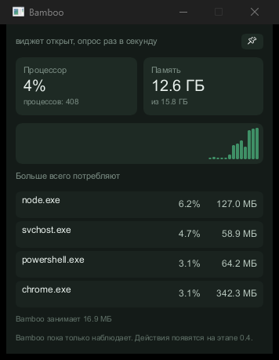
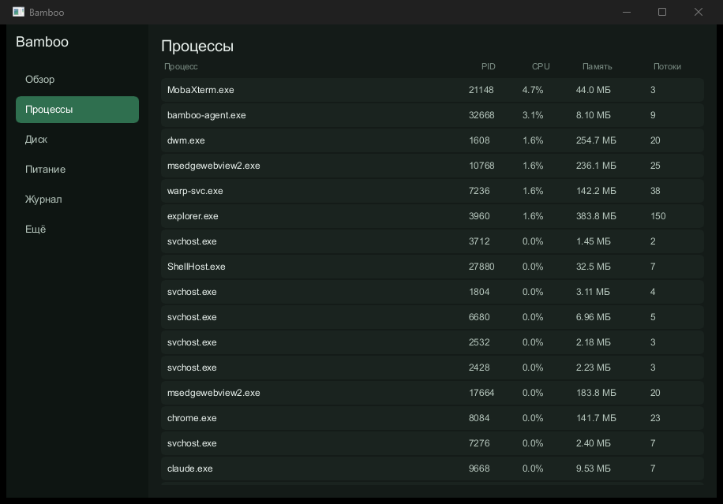

# Bamboo

[](https://github.com/Pandarens/Bamboo/actions/workflows/ci.yml)

Диагностика и оптимизация Windows 11 без плацебо.

Bamboo непрерывно наблюдает за системой, объясняет причины деградации производительности
и предлагает обратимые действия. Это не набор твиков реестра, а система наблюдения
с обратной связью: каждое действие измеримо, журналируется и отменяется.

Полное техническое задание — [bamboo-spec.md](bamboo-spec.md).
Подробный чеклист по этапам — [PROGRESS.md](PROGRESS.md).





## Состояние

Этап **0.1 — Наблюдатель** сделан, идёт этап **0.2 — Знание**
(по дорожной карте, раздел 18 ТЗ).

Bamboo пока ничего не меняет в системе — только наблюдает и объясняет.

| Крейт | Назначение | Готовность |
|---|---|---|
| `bamboo-core` | типы, единицы измерения, ошибки. Без зависимостей от Windows | есть |
| `bamboo-sys` | весь `unsafe`, обёртки над Win32/NT | процессы, ядра, память, питание, SMART, журналы событий |
| `bamboo-collect` | семплирование, кольцевые буферы, дельты | уровень L0 |
| `bamboo-analyze` | анализаторы, не знающие о Windows | износ SSD, рост памяти, регрессии загрузки |
| `bamboo-store` | персистентность, SQLite | уровни L2 и L3, история SMART, экспорт трасс |
| `bamboo-etw` | трассировка процессов | видеорегистратор, короткоживущие процессы |
| `bamboo-policy` | что можно делать и с чем | уровни риска, белые списки, профили, уведомления |
| `bamboo-journal` | журнал действий и откат | запись, откат, сторожевой таймер |
| `bamboo-actuate` | исполнение действий | EcoQoS, приоритет памяти, заморозка, автозагрузка |
| `bamboo-ipc` | протокол агент-брокер | сообщения, bincode, правила канала |
| `bamboo-service` | брокер под SYSTEM | валидация команд, консольный режим |
| `bamboo-agent` | трей и виджет | виджет с живыми метриками |
| `bamboo-cli` | отладочная утилита | все команды ниже |
| `tools/trace-replay` | прогон анализаторов на трассах | детект утечек по записи |

Все крейты дорожной карты заведены. Не доделаны отдельные крупные части
внутри них — главное окно, регистрация брокера как службы, локализация;
полный список открытого — в [PROGRESS.md](PROGRESS.md).

### Что уже умеет

- Снимок процессов одним системным вызовом, без открытия дескрипторов на чужие
  процессы
- Разделение нагрузки на процессную и драйверную (DPC и прерывания)
- Адаптивная частота опроса с гистерезисом
- SMART накопителей: NVMe без прав администратора, SATA — с ними
- Расход ресурса SSD с проекцией и успокаивающим выводом по умолчанию
- Причины пробуждений из сна
- История времени загрузки и компоненты, которые её удлиняют

## Права доступа

Часть данных Windows закрывает от обычного пользователя. Bamboo в таких случаях
говорит, чего именно не хватает, и не подставляет оценку вместо данных.

| Данные | Без прав администратора |
|---|---|
| Процессы, память, ядра, питание | доступны |
| SMART у NVMe | доступен |
| SMART у SATA | нужны права: ATA pass-through требует открыть диск на запись |
| Пробуждения из сна | доступны |
| История загрузок | нужны права: канал `Diagnostics-Performance` закрыт |
| Трассировка процессов через ETW | нужны права: или администратор, или группа «Пользователи журналов производительности» |

В готовом продукте закрытое читает брокер под SYSTEM, поэтому для пользователя
разницы не будет.

## Сборка

Нужен Rust stable и MSVC Build Tools с Windows SDK.

```bash
cargo build --release
```

## Как посмотреть

Виджет с иконкой в трее:

```bash
cargo run --release -p bamboo-agent
```

Отладочная утилита в терминале:

```bash
cargo run --release -p bamboo-cli -- snapshot
```

| Команда | Что показывает |
|---|---|
| `snapshot` | загрузка, память, топ потребителей и топ по записи |
| `watch` | то же непрерывно, с адаптивной частотой опроса |
| `disk` | накопители, их здоровье и расход ресурса |
| `boot` | время загрузки и что его удлиняет |
| `power` | пробуждения из сна и их причины |
| `trace --for 30` | короткоживущие процессы, невидимые для опроса |
| `record --out F` | записать трассу в файл для анализа |
| `diff` | что появилось в системе с прошлого снимка |
| `optimize` | что было бы сделано — ничего не меняет |
| `optimize --apply` | применить действия, записав их в журнал |
| `journal` | журнал действий |
| `revert --all` | откатить всё |
| `budget --for 60` | собственное потребление против лимитов раздела 4 ТЗ |

Все команды, кроме `optimize --apply`, только читают систему.

## Как устроены действия

Ни одно действие не выполняется без записи обратного рецепта в журнал.
Порядок жёсткий и обойти его нельзя:

1. Проверка политикой — можно ли вообще трогать эту цель
2. Снятие состояния «до». Не сняли — действие отменяется: откатить будет нечем
3. Запись в журнал **до** самого действия
4. Действие
5. Подтверждение или отметка о неудаче

Если процесс упадёт между третьим и пятым шагом, в журнале останется
неподтверждённая запись, и следующий запуск разберётся с ней.

Режим симуляции — поведение по умолчанию. `optimize` показывает список
и не трогает ничего; чтобы применить, нужен явный `--apply`.

## Что уже проверено

Замеры на релизной сборке:

| Что | Метрика | Замер | Лимит по ТЗ |
|---|---|---|---|
| Сбор метрик, 404 процесса | рабочий набор | 7.6 МБ | 15 МБ |
| Сбор метрик, 404 процесса | приватные байты | 2.6 МБ | 12 МБ |
| Агент, виджет открыт | рабочий набор | 22.2 МБ | 30 МБ |
| Агент, виджет открыт | приватные байты | 5.2 МБ | 25 МБ |
| База за 30 суток, 150 приложений | размер на диске | меньше 200 МБ | 200 МБ |

Бюджеты по CPU, числу пробуждений и записи на диск требуют суточного прогона —
он появится вместе с CI.

## Инварианты

Два правила, которые нельзя нарушать:

1. **Весь `unsafe` — только в `bamboo-sys`.** В остальных крейтах стоит
   `#![forbid(unsafe_code)]`. Это делает аудит выполнимым.
2. **`bamboo-analyze` не знает о Windows.** На вход — временные ряды,
   на выход — наблюдения. Логику детекции можно тестировать на записанных
   трассах без живой системы.

## Чего Bamboo не делает

Осознанно и навсегда:

- «Очистка RAM». `EmptyWorkingSet` не освобождает память, а вытесняет рабочий
  набор в файл подкачки. Приложение считывает всё обратно за секунды — результат
  только лишний ввод-вывод и износ SSD.
- Массовое отключение служб. В Windows 11 большая часть служб запускается
  по триггерам и в простое ничего не потребляет. Выигрыша нет, а Wi-Fi, печать
  и Store ломаются через недели, когда причина уже забыта.
- Дефрагментация реестра, «ускорение интернета», «оптимизация игр» —
  доказательств эффекта нет.
- Расчёт write amplification. Потребительские NVMe не отдают объём записей
  в NAND, вычислить WAF невозможно. Инструменты, показывающие эту цифру,
  её выдумывают.
- Антивирусные функции, файрвол, дебloating, разгон.

## Лицензия

GPLv3 — обусловлено лицензией Slint, используемого для интерфейса.
